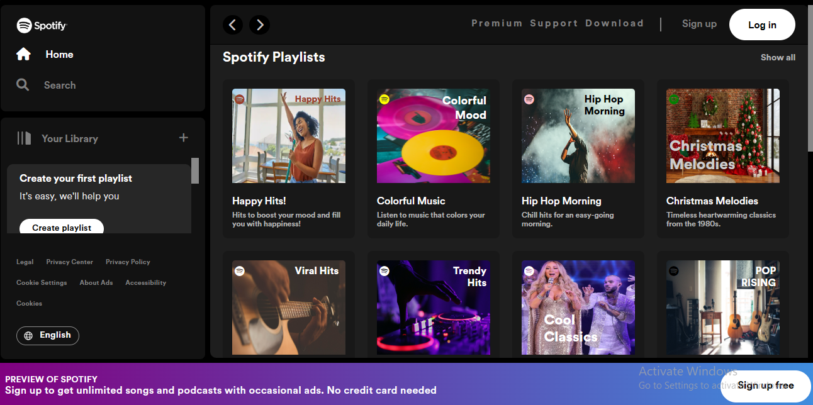

# Spotify Clone Project

## Task

- This is a simple project done by the Queen Koders team which involves which involves cloning the Spotify Music Homepage, Signup page and Login page.

## Description

- We collaborated on this project by:

 - Dividing the pages by the number of people in the group

 - Each member created a branch off of the main branch and worked on their part

 - Each member pushed to their branch

 - A member merged the branches together in the main branch

 - We adjusted the code to make sure everything worked fine.

 - And voila! We have a great project worked on by Queen Koders!!!

 ## Guideline to view the project

 To view the project on your local machine.
 - Clone the repository 

 ``git clone https://github.com/Perpy-del/Spotify-Clone.git``

 - Change your current working directory to the project directory

 ``cd Spotify-Clone``

 - Open the index.html file and run it on your local machine

 ## Contributors include
 - [Tosin Bamidele](https://github.com/TosinMary) 
 - [Chizaram Anisimuo](https://github.com/thezaram)
 - [Sylvia Nnoruka](https://github.com/SYLVIANNORUKA)
 - [Blessing Peter](https://github.com/blessingpeters)
 - [Stella Ugoo-Okonkwo](https://github.com/Ozyugoo)
 - [Wokrit Bakkuk](https://github.com/wokrit)
 - [Perpetual Meninwa](https://github.com/Perpy-del)
 - [Chioma Ekpemerechi](https://github.com/codiadem)
 - [Udoka Kasie](https://github.com/UdokaSuccess)

 ## Deployment
 The project was done using HTML and vanilla CSS. It was deployed using Vercel. Here is the link to the deployed project.
 [Spotify Clone](https://spotify-clone-perpy-del.vercel.app)

 ## Screenshot of the project

